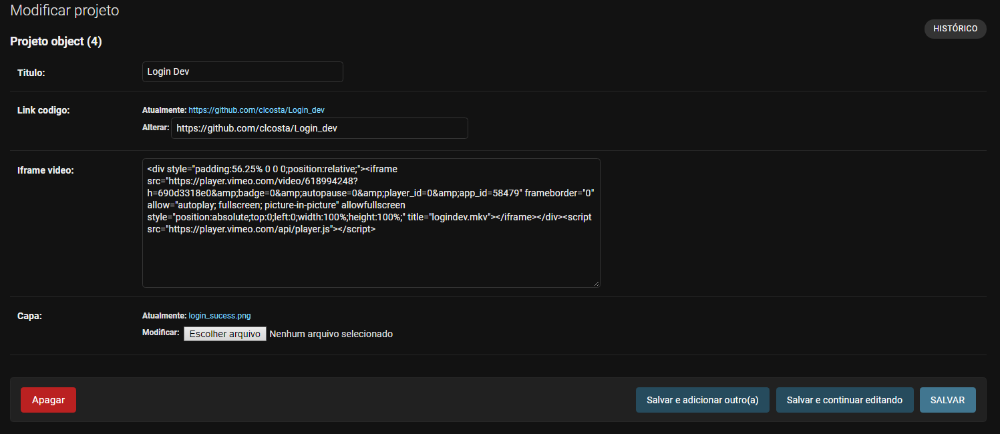

# Bem vindo ao **Portfolio  com o DJANGO**!
<p></p>

Neste arquivo você encontrará todas as especificações do site com o django. Como utilizar em servidor, e claro como utilizar todas as funcionalidades.   
--
---

## Instalação

1. Primeiramente caso já não tenha feito você pode clonar este repositório.

```
$ git clone https://github.com/clcosta/sites_django_flask
```

2. Agora a instalação das bibliotecas   
__Com a intenção de diminuir o requirements.txt eu criei uma versão para cada framework, então certifique-se de instalar o requirements do *DJANGO* que está neste mesmo diretorio.__

```python
pip install -r requirements.txt
```

3. Subir o servidor     
__Como estamos lidando com um site, vamos subir o servidor local, para isso no seu terminal utilize o comando__

```python
py manage.py runserver
```

 -> __Se tudo estiver certo você ja deve ter acesso ao servidor local com o site carregado__   
*OBS: Por padrão deste repositorio, o modo DEBUG é desativado*.

# Funcionalidades
Com tudo já instalado e o servidor local rodando o site vamos ver o que podemos fazer.
---

Como é esperado em um site de portfolio você tem que mostrar todos os seus projetos, o usuario já na página principal tem que conseguir ver um pouco sobre você e seus projetos. Como não irei upar o meu banco de dados neste repositorio vou refazer todo o passo a passo para upar os projetos no site.   

1. ### Criando o banco de dados
 *vamos utilizar o db.sqlite mesmo, padrão do django*
```python
py manage.py makemigrations

py manage.py migrate
```
__Se não tiver ocorrido nenhum problema, você tera um arquivo novo criado, chamado <ins>db.sqlite3</ins>, ele é o nosso banco de dados.__   

2. ### Criando um administrador
*por segurança, o unico tipo de usuario que pode ser criado nesse projeto é um __superuser__, um administrador criado direto no terminal da aplicação. Já que não é um site com objetivo de ter um fluxo de usuarios, ou sejá, sem criação de contas.*

```python
py manage.py createsuperuser
```
__Você poderá criar uma conta de administrador com usuario, senha e e-mail (apesar de não ser necessário e-mail)__  
    *para acessar o painel de ADM é só acessar no site __/admin__ no final do link*
```
localhost:8000/admin/
```
3. ### Criando um projeto
*No meu portfolio eu escolhi alguns campos para apresentar o meu projeto, sendo todos eles obrigatorios:*   
 *- Titulo*   
 *- Capa do Projeto (imagem) -> será a imagem que aparecerá na tela quando o mause passar em cima do titulo do projeto*   
 *- Link para um vídeo de apresentação -> será incorporado dentro do site em uma página de detalhes do projeto*   
 *- Link do código no github*   

*Existe uma página de criação para adicionar todos estes campos em um formato mais agradável, um formulario bem simples utilizando BOOTSTRAP, para acessar tal página é só utilizar o link __/projeto/new__*
```
localhost:8000/projeto/new
```
__OBS: Caso você <ins>NÃO esteja logado</ins> em um conta admin o formulario não será carregado, então é obrigatorio fazer o login com administrador antes de criar um projeto.__

__Se você fez tudo certo até aqui, terá uma tela parecida com essa, onde é so preencher os campos__

 
 [Como pegar o Iframe de um vídeo](https://vimeo.zendesk.com/hc/en-us/articles/224969968-Embedding-videos-overview)

__Agora com todos os campos preenchidos é só ir adicionado os projetos__
<br>


--- 
## "Eu digitei, ou enviei informações erradas pro projeto, e agora?"


Relaxe, caso tenha digitado alguma coisa errada ou enviado o arquivo errado, não se preucupe.

__No painel de admin do site, você consegue acesso a todos os projetos, e suas informações com detalhes.__

  _Painel geral_:    
  

---
  _Detalhes do projeto_:   
  


# Referências

- [Documentação oficial](https://docs.djangoproject.com/pt-br/3.2/)

- [Python Academy](https://pythonacademy.com.br/blog/desenvolvimento-web-com-python-e-django-introducao)

- [Youtube: Eduardo Mendes](https://www.youtube.com/watch?v=6a2ID5Ld6is&t=1099s)

- [Youtube: Fabio Ruicci](https://www.youtube.com/c/FabioRuicciCursos)

- [Youtube: Rafael Zottesso](https://www.youtube.com/c/rafaelzottesso)
